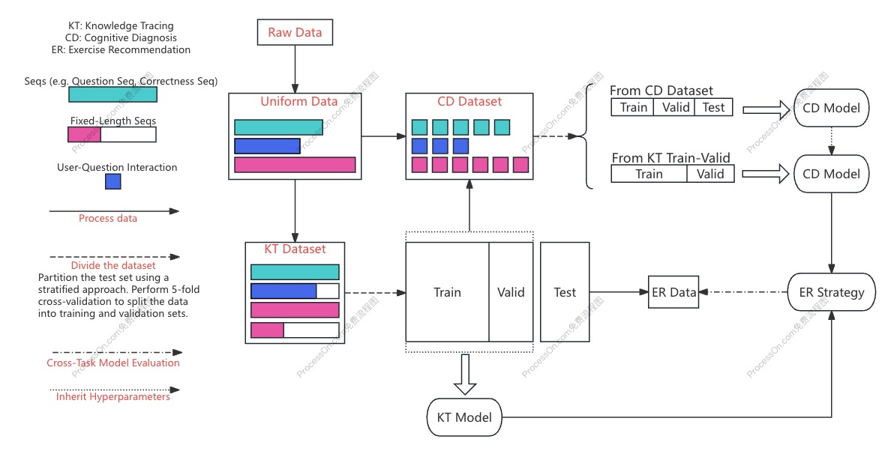
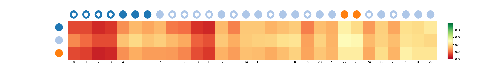
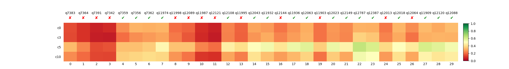
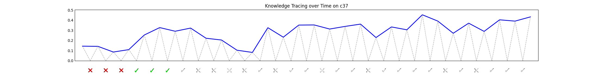

[](https://pypi.org/project/edmine/)

[中文](README_zh.md) | [Documentation] | [Related Papers] | [Dataset Information] | [Model Leaderboard]

[Documentation]: https://zhijiexiong.github.io/sub-page/pyedmine/document/site/index.html
[Dataset Information]: https://zhijiexiong.github.io/sub-page/pyedmine/datasetInfo.html
[Related Papers]: https://zhijiexiong.github.io/sub-page/pyedmine/paperCollection.html
[Model Leaderboard]: https://zhijiexiong.github.io/sub-page/pyedmine/rankingList.html

PyEdmine is an **educational data mining** codebase designed for researchers, with an emphasis on ease of development and reproducibility.

PyEdmine provides a unified experimental workflow for ***knowledge tracing***, ***cognitive diagnosis***, ***exercise recommendation***, and ***learning path recommendation***.

PyEdmine defines a unified, easy-to-use data-file format for dataset processing and already supports ***14 educational data mining datasets***.

PyEdmine provides a code framework for training and evaluating models. Based on this framework, it implements ***28 knowledge tracing models, 7 cognitive diagnosis models, 3 exercise recommendation models, and 4 learning path recommendation models***.

<p align="center">
  
  <br>
  <b>Figure</b>: PyEdmine experimental workflow
</p>

For the experimental settings of each task, see the [Model Leaderboard](https://zhijiexiong.github.io/sub-page/pyedmine/rankingList.html). The following describes each PyEdmine release.

| Releases | Date      |Description|
|----------|-----------|-----------|
| v0.1.0   | 3/26/2025 |Initial release|
| v0.1.1   | 3/31/2025 |Fixed several bugs and added ATDKT, CLKT, DTransformer, GRKT, and HDLPKT|
| v0.2.0   | 4/9/2025  |Beta release. Training GRKT raises an unresolved NaN error|
| v0.2.1   | 8/1/2025  |Fixed several bugs and integrated learning path recommendation|
| v0.2.2   | 8/3/2025  |Fixed several learning path recommendation bugs|
| v0.2.3   | 8/3/2025  |Adopted decorator-based model registration and removed the manually maintained `model_table`|
| v1.0.0   | 8/15/2025 |Stable long-term-support release; added qDKT_CORE, AKT_CORE, DisKT, and new KT metrics|


`v1.0.0` is the project's first long-term support (LTS) release and is fully backward compatible with every previously released version. Future updates will only add new models and will not break existing interfaces or functionality. **New users are recommended to use this release directly, and existing users are recommended to upgrade to it.**


- [Installation](#installation)
  - [Install from PyPI](#install-from-pypi)
  - [Install from source (recommended)](#install-from-source-recommended)
  - [Main dependencies](#main-dependencies)
- [Quick Start](#quick-start)
  - [Overview](#overview)
  - [Directory configuration](#directory-configuration)
  - [Data preprocessing](#data-preprocessing)
  - [Dataset splitting](#dataset-splitting)
  - [Model training](#model-training)
  - [Model evaluation](#model-evaluation)
    - [Knowledge tracing](#knowledge-tracing)
    - [Cognitive diagnosis](#cognitive-diagnosis)
    - [Exercise recommendation](#exercise-recommendation)
    - [Learning path recommendation](#learning-path-recommendation)
  - [Automatic hyperparameter tuning](#automatic-hyperparameter-tuning)
  - [Plotting changes in students' knowledge states](#plotting-changes-in-students-knowledge-states)
- [Dataset extensions](#dataset-extensions)
- [Referenced codebases](#referenced-codebases)
- [Contributing](#contributing)
  - [Before you begin](#before-you-begin)
  - [Report bugs or suggestions](#report-bugs-or-suggestions)
  - [Recommend papers](#recommend-papers)
  - [Contribute code](#contribute-code)
    - [Submit a pull request directly](#submit-a-pull-request-directly)
    - [Discuss before contributing](#discuss-before-contributing)
  - [Share pretrained model weights](#share-pretrained-model-weights)
  - [Code style and testing](#code-style-and-testing)
  - [Community code of conduct](#community-code-of-conduct)
- [Disclaimer](#disclaimer)


## Installation

### Install from PyPI

```bash
pip install edmine
```

### Install from source (recommended)
```bash
git clone git@github.com:ZhijieXiong/pyedmine.git && cd pyedmine
pip install -e .
```

### Main dependencies
Required dependencies: pandas, numpy, sklearn, and torch.

Optional dependencies: dgl is required by some cognitive diagnosis models; hyperopt is used for automated hyperparameter tuning; wandb is used to log experimental data; and tqdm is used during model evaluation.

## Quick Start
### Overview
Download the PyEdmine source code from GitHub, then use the scripts in `examples` for data preprocessing, dataset splitting, model training, and model evaluation. The basic PyEdmine workflow is below; run the steps in order:

1. Directory configuration: configure the storage paths for data and models in `settings.json`, then run `set_up.py` to create the required directories.

2. Data preprocessing: download the raw datasets and place them in the specified locations, then use the scripts in `examples` to preprocess the data into unified-format files. Dataset information is available [here](https://zhijiexiong.github.io/sub-page/pyedmine/datasetInfo.html).

3. Dataset splitting: split the unified-format data according to a specific experimental setting. PyEdmine provides five settings: two for knowledge tracing (inspired by [PYKT](https://dl.acm.org/doi/abs/10.5555/3600270.3601617) and [SFKT](https://dl.acm.org/doi/10.1145/3583780.3614988), respectively), one for cognitive diagnosis (inspired by [NCD](https://ojs.aaai.org/index.php/AAAI/article/view/6080)), one for offline exercise recommendation, and one for offline learning path recommendation.

4. Model training: `examples` provides a training script for each model. For more information, see [here](https://zhijiexiong.github.io/sub-page/pyedmine/document/site/index.html).

5. Model evaluation: `examples` also provides an evaluation script for each model, and implements evaluation metrics at different dimensions and granularities for different tasks, including cold-start evaluation and unbiased evaluation.

6. Other features: (1) PyEdmine implements Bayesian-optimization-based automatic hyperparameter tuning for selected models; (2) PyEdmine can enable wandb through configuration; and (3) it can plot changes in students' knowledge states.

For detailed instructions for each step, see below.

### Directory configuration
Create `settings.json` in the `examples` directory. Configure the data and model directories in this file as follows:
```json
{
  "FILE_MANAGER_ROOT": "/path/to/save/data",
  "MODELS_DIR": "/path/to/save/model"
}
```
Then run the script:
```bash
python examples/set_up.py
```
This automatically creates the raw-data and unified-format-data directories for datasets with built-in processing code. The raw-data directory for each dataset (under `/path/to/save/data/dataset_raw`) is as follows:
```
.
├── SLP
│   ├── family.csv
│   ├── psycho.csv
│   ├── school.csv
│   ├── student.csv
│   ├── term-bio.csv
│   ├── term-chi.csv
│   ├── term-eng.csv
│   ├── term-geo.csv
│   ├── term-his.csv
│   ├── term-mat.csv
│   ├── term-phy.csv
│   ├── unit-bio.csv
│   ├── unit-chi.csv
│   ├── unit-eng.csv
│   ├── unit-geo.csv
│   ├── unit-his.csv
│   ├── unit-mat.csv
│   └── unit-phy.csv
├── assist2009
│   └── skill_builder_data.csv
├── assist2009-full
│   └── assistments_2009_2010.csv
├── assist2012
│   └── 2012-2013-data-with-predictions-4-final.csv
├── assist2015
│   └── 2015_100_skill_builders_main_problems.csv
├── assist2017
│   └── anonymized_full_release_competition_dataset.csv
├── edi2020
│   ├── images
│   ├── metadata
│   │   ├── answer_metadata_task_1_2.csv
│   │   ├── answer_metadata_task_3_4.csv
│   │   ├── question_metadata_task_1_2.csv
│   │   ├── question_metadata_task_3_4.csv
│   │   ├── student_metadata_task_1_2.csv
│   │   ├── student_metadata_task_3_4.csv
│   │   └── subject_metadata.csv
│   ├── test_data
│   │   ├── quality_response_remapped_private.csv
│   │   ├── quality_response_remapped_public.csv
│   │   ├── test_private_answers_task_1.csv
│   │   ├── test_private_answers_task_2.csv
│   │   ├── test_private_task_4.csv
│   │   ├── test_private_task_4_more_splits.csv
│   │   ├── test_public_answers_task_1.csv
│   │   ├── test_public_answers_task_2.csv
│   │   └── test_public_task_4_more_splits.csv
│   └── train_data
│       ├── train_task_1_2.csv
│       └── train_task_3_4.csv
├── junyi2015
│   ├── junyi_Exercise_table.csv
│   ├── junyi_ProblemLog_original.csv
│   ├── relationship_annotation_testing.csv
│   └── relationship_annotation_training.csv
├── moocradar
│   ├── problem.json
│   ├── student-problem-coarse.json
│   ├── student-problem-fine.json
│   └── student-problem-middle.json
├── poj
│   └── poj_log.csv
├── slepemapy-anatomy
│   └── answers.csv
├── statics2011
│   └── AllData_student_step_2011F.csv
└── xes3g5m
    ├── kc_level
    │   ├── test.csv
    │   └── train_valid_sequences.csv
    ├── metadata
    │   ├── kc_routes_map.json
    │   └── questions.json
    └── question_level
        ├── test_quelevel.csv
        └── train_valid_sequences_quelevel.csv
```

### Data preprocessing
You can use our dataset preprocessing script:
```bash
python data_preprocess/kt_data.py
```
This script generates the unified-format dataset files (under `/path/to/save/data/dataset/dataset_preprocessed`).

Note: because the `Ednet-kt1` dataset contains too many raw data files, first use `examples/data_preprocess/generate_ednet_raw.py` to aggregate user data in units of 5,000. Because this dataset is very large, preprocessing uses only the 5,000 users with the longest interaction sequences by default.

Alternatively, you can directly download the preprocessed [dataset files](https://drive.google.com/drive/folders/14ZLY7B_Tgs8k82qW3eQD7ufcHh0Bq50W?usp=sharing) (under `dataset/dataset_preprocessed`).

### Dataset splitting
You can use the dataset-splitting scripts we provide. The resulting dataset files will be stored under `/path/to/save/data/dataset/settings/[setting_name]`.
```bash
python examples/knowledge_tracing/prepare_dataset/pykt_setting.py  # knowledge tracing
python examples/cognitive_diagnosis/prepare_dataset/ncd_setting.py  # cognitive diagnosis
python examples/exercise_recommendation/preprare_dataset/offline_setting.py  # exercise recommendation

```

You can also directly download the [split dataset files](https://drive.google.com/drive/folders/14ZLY7B_Tgs8k82qW3eQD7ufcHh0Bq50W?usp=sharing) (under `dataset/settings`) and place them in `/path/to/save/data/dataset/settings`.

Or, you can use the provided dataset-splitting scripts as a reference to design your own experimental workflow.

### Model training
For models that do not require additional information to be generated, run the training code directly, for example:
```bash
python examples/knowledge_tracing/train/dkt.py  # train DKT with default parameters
python examples/cognitive_diagnosis/train/ncd.py  # train NCD with default parameters
```
For models that require additional information to be generated in advance—for example, DIMKT requires difficulty information and HyperCD requires knowledge-concept hypergraph information—run the corresponding generation script first, for example:
```bash
python examples/knowledge_tracing/dimkt/get_difficulty.py  # generate difficulty information required by DIMKT
python examples/cognitive_diagnosis/hyper_cd/construct_hyper_graph.py  # generate graph information required by HyperCD
```

Learning path recommendation requires a knowledge tracing model as an environment simulator. Therefore, train a knowledge tracing model first. PyEdmine currently implements environment simulators based on qDKT and LPKT4LPR.

The epoch-based trainer produces output similar to the following during training:
```bash
2025-06-19 10:59:21 start loading and processing dataset
2025-06-19 10:59:38 start training
2025-06-19 10:59:44 epoch 1   , valid performances are main metric: 0.76521  , AUC: 0.76521  , ACC: 0.84833  , MAE: 0.23686  , RMSE: 0.34025  , train loss is predict loss: 0.406844    , current best epoch is 1
2025-06-19 11:00:11 epoch 2   , valid performances are main metric: 0.77796  , AUC: 0.77796  , ACC: 0.85032  , MAE: 0.23244  , RMSE: 0.33654  , train loss is predict loss: 0.376817    , current best epoch is 2
2025-06-19 11:00:40 epoch 3   , valid performances are main metric: 0.78149  , AUC: 0.78149  , ACC: 0.85163  , MAE: 0.22629  , RMSE: 0.33514  , train loss is predict loss: 0.371912    , current best epoch is 3
2025-06-19 11:01:08 epoch 4   , valid performances are main metric: 0.78366  , AUC: 0.78366  , ACC: 0.85256  , MAE: 0.22437  , RMSE: 0.33424  , train loss is predict loss: 0.369758    , current best epoch is 4
2025-06-19 11:01:37 epoch 5   , valid performances are main metric: 0.78437  , AUC: 0.78437  , ACC: 0.85268  , MAE: 0.21839  , RMSE: 0.33416  , train loss is predict loss: 0.368626    , current best epoch is 4

...

2025-06-19 11:06:12 epoch 37  , valid performances are main metric: 0.78987  , AUC: 0.78987  , ACC: 0.85457  , MAE: 0.2147   , RMSE: 0.33187  , train loss is predict loss: 0.362751    , current best epoch is 21
2025-06-19 11:06:17 epoch 38  , valid performances are main metric: 0.7907   , AUC: 0.7907   , ACC: 0.85463  , MAE: 0.21792  , RMSE: 0.3316   , train loss is predict loss: 0.362828    , current best epoch is 21
2025-06-19 11:06:23 epoch 39  , valid performances are main metric: 0.78943  , AUC: 0.78943  , ACC: 0.85388  , MAE: 0.22209  , RMSE: 0.33233  , train loss is predict loss: 0.362957    , current best epoch is 21
2025-06-19 11:06:29 epoch 40  , valid performances are main metric: 0.79026  , AUC: 0.79026  , ACC: 0.85434  , MAE: 0.21326  , RMSE: 0.33218  , train loss is predict loss: 0.362876    , current best epoch is 21
2025-06-19 11:06:35 epoch 41  , valid performances are main metric: 0.79023  , AUC: 0.79023  , ACC: 0.8546   , MAE: 0.22441  , RMSE: 0.33173  , train loss is predict loss: 0.362758    , current best epoch is 21
best valid epoch: 21  , train performances in best epoch by valid are main metric: 0.79207  , AUC: 0.79207  , ACC: 0.85297  , MAE: 0.22056  , RMSE: 0.33278  , main_metric: 0.79207  , 
valid performances in best epoch by valid are main metric: 0.7898   , AUC: 0.7898   , ACC: 0.85434  , MAE: 0.21901  , RMSE: 0.33197  , main_metric: 0.7898   , 
```
The step-based trainer produces output similar to the following during training:
```bash
2025-08-01 19:16:44 start loading and processing dataset
2025-08-01 19:17:08 start training
2025-08-01 19:17:28 step 100      : train loss is concept state loss: 0.867828    , concept action loss: -1.51221    , question state loss: 0.338242    , question action loss: -1.80328    , 
2025-08-01 19:17:50 step 200      : train loss is concept state loss: 0.818596    , concept action loss: -1.46902    , question state loss: 0.308322    , question action loss: -1.78957    , 
2025-08-01 19:18:14 step 300      : train loss is concept state loss: 0.823793    , concept action loss: -1.48536    , question state loss: 0.309225    , question action loss: -2.42813    , 
2025-08-01 19:18:35 step 400      : train loss is concept state loss: 0.701109    , concept action loss: -1.35137    , question state loss: 0.235002    , question action loss: -3.50641    , 
2025-08-01 19:18:58 step 500      : train loss is concept state loss: 0.738613    , concept action loss: -1.4045     , question state loss: 0.258047    , question action loss: -3.9537     , 
2025-08-01 19:32:58 step 500      , valid performance are
main metric: -0.008321982840624414
step5, AP: -0.033304, APR: -0.0063331, RP: -0.033304, RPR: -0.0063331, NRP: -0.061017, NRPR: -0.011474, 
step10, AP: -0.046469, APR: -0.0041848, RP: -0.046469, RPR: -0.0041848, NRP: -0.08442 , NRPR: -0.0075014, 
step20, AP: -0.067674, APR: -0.0033046, RP: -0.067674, RPR: -0.0033046, NRP: -0.12283 , NRPR: -0.0059905, 

...

2025-08-01 21:53:24 step 5100     : train loss is concept state loss: 0.212986    , concept action loss: -0.765349   , question state loss: 0.0368868   , question action loss: -1.31573    , 
2025-08-01 21:53:46 step 5200     : train loss is concept state loss: 0.199054    , concept action loss: -0.732374   , question state loss: 0.0336832   , question action loss: -1.18531    , 
2025-08-01 21:54:08 step 5300     : train loss is concept state loss: 0.208855    , concept action loss: -0.761285   , question state loss: 0.0397747   , question action loss: -1.28841    , 
2025-08-01 21:54:28 step 5400     : train loss is concept state loss: 0.178077    , concept action loss: -0.706407   , question state loss: 0.0257976   , question action loss: -1.04622    , 
2025-08-01 21:54:49 step 5500     : train loss is concept state loss: 0.191855    , concept action loss: -0.728117   , question state loss: 0.0346215   , question action loss: -1.20783    , 
2025-08-01 22:08:29 step 5500     , valid performance are
main metric: -0.012395949990968961
step5, AP: -0.05172 , APR: -0.0097354, RP: -0.05172 , RPR: -0.0097354, NRP: -0.097195, NRPR: -0.018089, 
step10, AP: -0.06721 , APR: -0.0062151, RP: -0.06721 , RPR: -0.0062151, NRP: -0.12677 , NRPR: -0.011617, 
step20, AP: -0.083493, APR: -0.0039493, RP: -0.083493, RPR: -0.0039493, NRP: -0.15846 , NRPR: -0.0074827, 

best valid step: 500      
valid performance by best valid epoch is {"5": {"AP": -0.03330377663327104, "APR": -0.00633306784213987, "RP": -0.03330377663327104, "RPR": -0.00633306784213987, "NRP": -0.061017051242375234, "NRPR": -0.011473998633936285}, "10": {"AP": -0.04646934891696771, "APR": -0.004184800090990535, "RP": -0.04646934891696771, "RPR": -0.004184800090990535, "NRP": -0.08442007529036973, "NRPR": -0.007501426604322975}, "20": {"AP": -0.06767395292607752, "APR": -0.0033046125319343496, "RP": -0.06767395292607752, "RPR": -0.0033046125319343496, "NRP": -0.12283069568440122, "NRPR": -0.005990523283613981}}
```
If the `use_wandb` parameter is `True` when training a model, you can view changes in its loss and metrics on [wandb](https://wandb.ai/).

### Model evaluation
If the `save_model` parameter is `True` during training, the model parameter file is saved under `/path/to/save/model`. You can then evaluate the model using the test set, for example:
```bash
python examples/knowledge_tracing/evaluate/sequential_dlkt.py --model_dir_name [model_dir_name] --dataset_name [dataset_name] --test_file_name [test_file_name]
```
In addition to conventional metric evaluation, knowledge tracing and cognitive diagnosis models can perform fine-grained evaluations, such as cold-start evaluation and multi-step prediction for knowledge tracing. Enable these evaluations by setting the corresponding parameters.

The meanings of the different metrics are as follows:

#### Knowledge tracing
- overall: predicts from the second interaction in a sequence onward.
- core: the metric proposed in [Do We Fully Understand Students’ Knowledge States? Identifying and Mitigating Answer Bias in Knowledge Tracing](https://arxiv.org/abs/2308.07779).
- double warm start, seqStart5QueNum5: predicts from the fifth interaction onward, and only for exercises that appear at least five times in training.
- user cold start, seqEnd5: predicts only the first five interactions of a sequence.
- question cold start, queNum5: predicts only exercises that appear at most five times in the training set.
- double cold start, seqEnd5queNum5: predicts only exercises that appear at most five times in the training set among the first five interactions of a sequence.
- user warm start, seqStart50: predicts only interactions after the 50th interaction in a sequence.
- multi step: the two multi-step prediction settings described in [pyKT: A Python Library to Benchmark Deep Learning based Knowledge Tracing Models](https://dl.acm.org/doi/abs/10.5555/3600270.3601617).
- first trans: predicts only the first time each knowledge concept is encountered in each student's interaction sequence.
- hard sample metric, question hard sample-th0.05: let the exercise accuracy in the training set be `acc_q`. For an interaction, if `acc_q >= (0.5 + 0.05)` and the current exercise is answered correctly, or `acc_q <= (0.5 - 0.05)` and it is answered incorrectly, it is considered a hard sample (from question).
- hard sample metric, concept hard sample-th0.05: similar to question hard sample.
- hard sample metric, history hard sample-th0.05: similar to question hard sample, using the student's historical accuracy as the reference.
- BES: Bias Exposure Score, which measures how much a model is affected by data bias. The bias comes from history, knowledge concepts, and exercises; a smaller value means the model is more affected by data bias.
  - Note: this metric has not been validated.
  
#### Cognitive diagnosis
- overall: predicts the entire test set.
- user cold start, userNum5: predicts only students who appear at most five times in the training set.
- question cold start, questionNum5: predicts only exercises that appear at most five times in the training set.
#### Exercise recommendation
- KG4EX_ACC: a metric proposed in [KG4Ex: An Explainable Knowledge Graph-Based Approach for Exercise Recommendation](https://dl.acm.org/doi/10.1145/3583780.3614943). Results published on this leaderboard are calculated with DKT.
- KG4EX_NOV: the same as KG4EX_ACC.
- OFFLINE_ACC: uses exercises a student will practice in the future as labels and calculates accuracy.
- OFFLINE_NDCG: uses exercises a student will practice in the future as labels and calculates NDCG.
- PERSONALIZATION_INDEX: calculates the diversity of recommended exercises across students as a personalization metric.
#### Learning path recommendation
$m_{start}$ and $m_{end}$ are the initial and final scores for the target knowledge concept, respectively; $m_{full}$ is the full score for the knowledge concept; and $l$ is the path length.
- AP = $m_{end} - m_{start}$
- APR = $\frac{m_{end} - m_{start}}{l}$
- RP = $\frac{AP}{m_{full}}$
- RPR = $\frac{RP}{l}$
- NRP = $\frac{AP}{m_{full} - m_{start}}$
- NRPR = $\frac{NRP}{l}$

You can also download [pretrained models](https://huggingface.co/dreamxzj123/pyedmine) (including all KT, CD, ER, and LPR models) and evaluate them using the experimental settings we provide.

### Automatic hyperparameter tuning
PyEdmine also supports automatic hyperparameter tuning based on Bayesian optimization, for example:
```bash
python examples/cognitive_diagnosis/train/ncd_search_params.py
```
This script sets the search space using the `parameters_space` variable in the code.

### Plotting changes in students' knowledge states
PyEdmine supports visualizing changes in students' knowledge states with heatmaps. The corresponding code is:

```bash
python examples/roster/kt_plot.py
```

The result is shown below:





## Dataset extensions
[edi2020-task-34-question.json](./edi2020-task34-question.json) is an unofficial extension based on the mathematical-question image data provided by **EDi2020 Task 3&4**. The original dataset contains only question images and does not provide the corresponding text. To improve its applicability to knowledge tracing and text modeling tasks, I extracted the question text and organized it with reference to the data format of [Kaggle Eedi: Mining Misconceptions in Mathematics](https://www.kaggle.com/competitions/eedi-mining-misconceptions-in-mathematics) for subsequent use.

The text-extraction process is relatively simple and mainly includes:

Recognizing text in images with OCR tools;

Generating textual descriptions with multimodal large language models for questions that OCR cannot recognize effectively;

Performing simple manual checking and corrections.

Although the text information is generally highly accurate, individual extraction errors may remain. This is an **unofficial extension**. The community is welcome to use it as a reference, but validation and cleaning based on the needs of specific research are recommended.

## Referenced codebases

- [PYKT](https://github.com/pykt-team/pykt-toolkit)
- [EduKTM](https://github.com/bigdata-ustc/EduKTM)
- [EduCDM](https://github.com/bigdata-ustc/EduCDM)
- [RecBole](https://github.com/RUCAIBox/RecBole)
- [More_Simple_Reinforcement_Learning](https://github.com/lansinuote/More_Simple_Reinforcement_Learning)
- [Other paper code repositories](https://zhijiexiong.github.io/sub-page/pyedmine/paperCollection.html)

## Contributing

Thank you for your interest in and support for PyEdmine. We welcome all forms of community contribution, including reporting issues, suggesting improvements, submitting code enhancements, and sharing training results.

### Before you begin

Please read this README and the [project documentation](https://zhijiexiong.github.io/sub-page/pyedmine/document/site/index.html) to understand the project's goals, structure, and core workflow.

### Report bugs or suggestions

If you find a bug or have a suggestion, please open a GitHub **Issue**. Include the following information in the issue—the more detail, the better:

- The PyEdmine version you used (for example, `v1.0.0`)
- A description of the issue and steps to reproduce it
- Error messages, logs, screenshots, or other relevant information

### Recommend papers

We welcome recommendations for educational data mining papers to be included among the models supported by this project. Please post your recommendation in the **[Feature Request Thread](https://github.com/ZhijieXiong/pyedmine/discussions/8)**.

### Contribute code

You can contribute code in either of the following ways:

#### Submit a pull request directly

This is suitable for small fixes or updates with no expected conflicts, such as:

- Documentation updates
- Simple bug fixes
- Small feature enhancements that do not affect existing functionality

Please ensure that your pull request includes:

- A clear description and purpose of the change
- Appropriate unit tests, when applicable
- Clean formatting that follows the project's code conventions

#### Discuss before contributing

For larger changes, such as adding a model or modifying framework logic, we recommend that you:

1. Describe your plan and design in an Issue.
2. Reach agreement with the maintainers through discussion.
3. Submit a pull request to facilitate review and collaboration.

### Share pretrained model weights

To share pretrained model weights, email 18800118477@163.com.

Please include:

- The model-weight file or a download link
- The corresponding training script or documentation
- Relevant parameter configuration and dependency information

We will review the submission and consider integrating the weights.

If you are submitting a new model that PyEdmine does not yet implement, first submit its implementation in a pull request, then notify us by email.

### Code style and testing

Please follow the code style used in this project. Good practices include, but are not limited to:

- Maintaining consistent indentation and code structure
- Adding or updating documentation comments and README content

### Community code of conduct

- Be friendly and respectful to others
- State questions and ideas clearly
- Welcome questions and help others

## Disclaimer

PyEdmine is developed under the [MIT License](./LICENSE). All data and code in this project may be used only for academic purposes.
