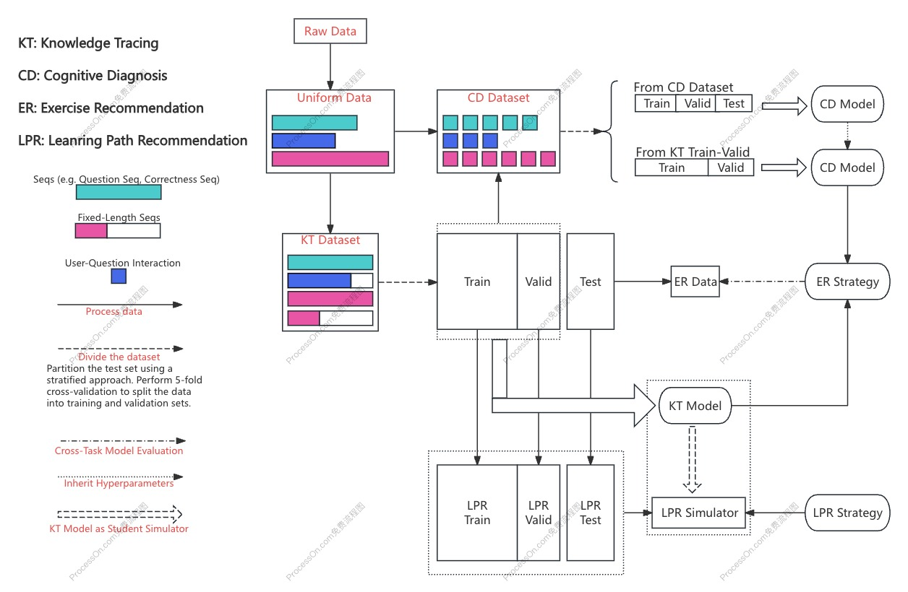

# PyEdmine

[](https://pypi.org/project/edmine/)

[Documentation] | [Dataset Information] | [EDM Papers] | [Model Leaderboard]

[Documentation]: https://zhijiexiong.github.io/sub-page/pyedmine/document/site/index.html
[Dataset Information]: https://zhijiexiong.github.io/sub-page/pyedmine/datasetInfo.html
[EDM Papers]: https://zhijiexiong.github.io/sub-page/pyedmine/paperCollection.html
[Model Leaderboard]: https://zhijiexiong.github.io/sub-page/pyedmine/rankingList.html

PyEdmine is a researcher-oriented, easy-to-develop and reproducible code library for educational data mining

It currently implements 26 knowledge tracing models, 7 cognitive diagnosis models, and 3 exercise recommendation models

We have defined a unified and user-friendly data file format and support 14 benchmark datasets

Additionally, we designed a unified experimental setup where knowledge tracing models and cognitive diagnosis models can be evaluated on exercise recommendation tasks

<p align="center">
  
  <br>
  <b>Image</b>: PyEdmine Experimental Flowchart
</p>

## Installation

### Install via pip

```bash
pip install edmine
```

### Installation from source (Recommended)
```bash
git clone git@github.com:ZhijieXiong/pyedmine.git && cd pyedmine
pip install -e .
```

### Main Dependencies
Required dependencies: `pandas`, `numpy`, `sklearn`, `torch`

Optional dependencies: `dgl` is required by some cognitive diagnosis models; `hyperopt` is used for automated parameter tuning; `wandb` is used for recording experimental data; `tqdm` is used during the model evaluation phase.

## Quick Start
Please download the source code of PyEdmine from GitHub, and then use the scripts provided in the `examples` directory to perform data preprocessing, dataset splitting, model training, and model evaluation. The basic workflow of the PyEdmine framework is as follows—please follow the steps in order:

1. Directory Configuration: Configure the storage paths for data and models via the `settings.json` file, then run `set_up.py` to create the necessary directories;

2. Data Preprocessing: Download the raw dataset and place it in the specified location, then run the scripts in the `examples` directory to preprocess the data and obtain a standardized data file. Dataset details can be found [here](https://zhijiexiong.github.io/sub-page/pyedmine/datasetInfo.html);

3. Dataset Splitting: Split the standardized data file according to specific experimental settings. PyEdmine provides four experiment settings: two knowledge tracing tasks (following the setups from [PYKT](https://dl.acm.org/doi/abs/10.5555/3600270.3601617) and [SFKT](https://dl.acm.org/doi/10.1145/3583780.3614988) respectively), one cognitive diagnosis task (following [NCD](https://ojs.aaai.org/index.php/AAAI/article/view/6080)), and one exercise recommendation task;

4. Model Training: Training scripts for each model are provided in the `examples` directory. For more details, please refer to this [documentation](https://zhijiexiong.github.io/sub-page/pyedmine/document/site/index.html);

5. Model Evaluation: Evaluation scripts for each model are also provided in the `examples` directory. PyEdmine implements evaluation metrics from multiple perspectives and at different levels of granularity, including cold-start evaluation and unbiased evaluation;

6. Other Features: (1)PyEdmine supports automatic hyperparameter optimization for some models using Bayesian optimization; (2) PyEdmine allows enabling wandb integration through parameter configuration.

For detailed instructions on each step, please refer to the following sections.

### Directory Configuration
Create a `settings.json` file in the `examples` directory to configure the data and model directories, as shown below:
```json
{
  "FILE_MANAGER_ROOT": "/path/to/save/data",
  "MODELS_DIR": "/path/to/save/model"
}
```
Then run the script:
```bash
python examples/set_up.py
```
This will automatically generate directories for raw dataset files (located at `/path/to/save/data/dataset/dataset_raw`) and directories for uniformly processed files. The raw dataset directories are structured as follows:
```
.
├── SLP
│   ├── family.csv
│   ├── psycho.csv
│   ├── school.csv
│   ├── student.csv
│   ├── term-bio.csv
│   ├── term-chi.csv
│   ├── term-eng.csv
│   ├── term-geo.csv
│   ├── term-his.csv
│   ├── term-mat.csv
│   ├── term-phy.csv
│   ├── unit-bio.csv
│   ├── unit-chi.csv
│   ├── unit-eng.csv
│   ├── unit-geo.csv
│   ├── unit-his.csv
│   ├── unit-mat.csv
│   └── unit-phy.csv
├── assist2009
│   └── skill_builder_data.csv
├── assist2009-full
│   └── assistments_2009_2010.csv
├── assist2012
│   └── 2012-2013-data-with-predictions-4-final.csv
├── assist2015
│   └── 2015_100_skill_builders_main_problems.csv
├── assist2017
│   └── anonymized_full_release_competition_dataset.csv
├── edi2020
│   ├── images
│   ├── metadata
│   │   ├── answer_metadata_task_1_2.csv
│   │   ├── answer_metadata_task_3_4.csv
│   │   ├── question_metadata_task_1_2.csv
│   │   ├── question_metadata_task_3_4.csv
│   │   ├── student_metadata_task_1_2.csv
│   │   ├── student_metadata_task_3_4.csv
│   │   └── subject_metadata.csv
│   ├── test_data
│   │   ├── quality_response_remapped_private.csv
│   │   ├── quality_response_remapped_public.csv
│   │   ├── test_private_answers_task_1.csv
│   │   ├── test_private_answers_task_2.csv
│   │   ├── test_private_task_4.csv
│   │   ├── test_private_task_4_more_splits.csv
│   │   ├── test_public_answers_task_1.csv
│   │   ├── test_public_answers_task_2.csv
│   │   └── test_public_task_4_more_splits.csv
│   └── train_data
│       ├── train_task_1_2.csv
│       └── train_task_3_4.csv
├── junyi2015
│   ├── junyi_Exercise_table.csv
│   ├── junyi_ProblemLog_original.csv
│   ├── relationship_annotation_testing.csv
│   └── relationship_annotation_training.csv
├── moocradar
│   ├── problem.json
│   ├── student-problem-coarse.json
│   ├── student-problem-fine.json
│   └── student-problem-middle.json
├── poj
│   └── poj_log.csv
├── slepemapy-anatomy
│   └── answers.csv
├── statics2011
│   └── AllData_student_step_2011F.csv
└── xes3g5m
    ├── kc_level
    │   ├── test.csv
    │   └── train_valid_sequences.csv
    ├── metadata
    │   ├── kc_routes_map.json
    │   └── questions.json
    └── question_level
        ├── test_quelevel.csv
        └── train_valid_sequences_quelevel.csv
```

### Data Preprocessing
You can use our dataset preprocessing script:
```bash
python data_preprocess/kt_data.py
```
This script will generate uniformly formatted dataset files (located at `/path/to/save/data/dataset/dataset_preprocessed`)

Note: For the `Ednet-kt1` dataset, due to the large number of raw data files, you need to first use the script `examples/data_preprocess/generate_ednet_raw.py` to aggregate user data in units of 5000. Additionally, because this dataset is too large, the preprocessing defaults to using data from the 5000 longest users

Alternatively, you can directly download the preprocessed [dataset files](https://drive.google.com/drive/folders/1f5hw6PSKWDanVhVVqU1qS-_RxNYNdl9v?usp=sharing)

### Dataset Splitting
You can use our dataset splitting scripts. The split dataset files will be saved under `/path/to/save/data/dataset/settings/[setting_name]`:
```bash
python examples/knowledge_tracing/prepare_dataset/pykt_setting.py  # Knowledge Tracing
python examples/cognitive_diagnosis/prepare_dataset/ncd_setting.py  # Cognitive Diagnosis
python examples/exercise_recommendation/preprare_dataset/offline_setting.py  # Exercise Recomme
```
You can also directly download the split dataset files ([pykt_setting](https://www.alipan.com/s/Lek2EDxPfUJ),[sfkt_setting](https://www.alipan.com/s/NfUiLwfoAsK), [ncd_setting](https://drive.google.com/drive/folders/1TDap7nmwPQ7EP4FUpyv6hvo8UkDBeh0R?usp=sharing), [ER_offline_setting](https://www.alipan.com/s/BJQHQn3waA6), [CD4ER_offline_setting](https://drive.google.com/drive/folders/13HHuyOQq31hCP9V8rNUF70ppWvlivxHS?usp=sharing)) and place them in `/path/to/save/data/dataset/settings`

Alternatively, you can refer to our dataset splitting scripts to design your own experimental processing pipeline

### Model Training
For models that do not require generating additional information, simply run the training code, e.g.:
```bash
python examples/knowledge_tracing/train/dkt.py  # Train DKT model with default parameters 
python examples/cognitive_diagnosis/train/ncd.py  # Train NCD model with default parameters
```
For models that require pre-generating additional information, such as DIMKT needing to pre-calculate difficulty information or HyperCD needing to construct knowledge point hypergraph information, you need to first run the corresponding additional information generation script, e.g.:
```bash
python examples/knowledge_tracing/dimkt/get_difficulty.py  # # Generate difficulty information for DIMKT  
python examples/cognitive_diagnosis/hyper_cd/construct_hyper_graph.py  # Generate graph information for HyperCD  
```
During training, you will see output similar to the following:
```bash
2025-03-06 02:12:35 epoch 1   , valid performances are main metric: 0.7186   , AUC: 0.7186   , ACC: 0.64765  , MAE: 0.41924  , RMSE: 0.46919  , train loss is predict loss: 0.588902    , current best epoch is 1
2025-03-06 02:12:37 epoch 2   , valid performances are main metric: 0.72457  , AUC: 0.72457  , ACC: 0.63797  , MAE: 0.42329  , RMSE: 0.47456  , train loss is predict loss: 0.556672    , current best epoch is 2
2025-03-06 02:12:39 epoch 3   , valid performances are main metric: 0.72014  , AUC: 0.72014  , ACC: 0.63143  , MAE: 0.43218  , RMSE: 0.47536  , train loss is predict loss: 0.551513    , current best epoch is 2
2025-03-06 02:12:40 epoch 4   , valid performances are main metric: 0.71843  , AUC: 0.71843  , ACC: 0.65182  , MAE: 0.41843  , RMSE: 0.46837  , train loss is predict loss: 0.548907    , current best epoch is 2
2025-03-06 02:12:42 epoch 5   , valid performances are main metric: 0.72453  , AUC: 0.72453  , ACC: 0.65276  , MAE: 0.41841  , RMSE: 0.46684  , train loss is predict loss: 0.547639    , current best epoch is 2
...
2025-03-06 02:13:44 epoch 31  , valid performances are main metric: 0.72589  , AUC: 0.72589  , ACC: 0.65867  , MAE: 0.40794  , RMSE: 0.46316  , train loss is predict loss: 0.532516    , current best epoch is 16
2025-03-06 02:13:47 epoch 32  , valid performances are main metric: 0.72573  , AUC: 0.72573  , ACC: 0.65426  , MAE: 0.41602  , RMSE: 0.46415  , train loss is predict loss: 0.532863    , current best epoch is 16
2025-03-06 02:13:49 epoch 33  , valid performances are main metric: 0.72509  , AUC: 0.72509  , ACC: 0.6179   , MAE: 0.43133  , RMSE: 0.48417  , train loss is predict loss: 0.532187    , current best epoch is 16
2025-03-06 02:13:52 epoch 34  , valid performances are main metric: 0.72809  , AUC: 0.72809  , ACC: 0.63938  , MAE: 0.41994  , RMSE: 0.47377  , train loss is predict loss: 0.533765    , current best epoch is 16
2025-03-06 02:13:54 epoch 35  , valid performances are main metric: 0.72523  , AUC: 0.72523  , ACC: 0.63852  , MAE: 0.42142  , RMSE: 0.47327  , train loss is predict loss: 0.531101    , current best epoch is 16
2025-03-06 02:13:57 epoch 36  , valid performances are main metric: 0.72838  , AUC: 0.72838  , ACC: 0.61986  , MAE: 0.43105  , RMSE: 0.48364  , train loss is predict loss: 0.532342    , current best epoch is 16
best valid epoch: 16  , train performances in best epoch by valid are main metric: 0.74893  , AUC: 0.74893  , ACC: 0.72948  , MAE: 0.34608  , RMSE: 0.42706  , main_metric: 0.74893  , 
valid performances in best epoch by valid are main metric: 0.72902  , AUC: 0.72902  , ACC: 0.59389  , MAE: 0.43936  , RMSE: 0.49301  , main_metric: 0.72902  , 
```
If the use_wandb parameter is set to True during model training, you can view the model's loss and metric changes on [wandb](https://wandb.ai/)

### Model Evaluation
If the *save_model* parameter is set during model training, the model parameter files will be saved in the `/path/to/save/model directory`. You can then evaluate the model on the test set, e.g.:
```bash
python examples/knowledge_tracing/evaluate/sequential_dlkt.py --model_dir_name [model_dir_name] --dataset_name [dataset_name] --test_file_name [test_file_name]
```
In addition to conventional metric evaluation, knowledge tracing and cognitive diagnosis models can also undergo fine-grained evaluations, such as cold-start evaluation and multi-step prediction for knowledge tracing. These evaluations can be enabled by setting the corresponding parameters

Here describes the meaning of various evaluation metrics:

#### Knowledge Tracing

- overall: Prediction begins from the second interaction in each sequence.
- core: A metric proposed in the paper *[Do We Fully Understand Students’ Knowledge States? Identifying and Mitigating Answer Bias in Knowledge Tracing](https://arxiv.org/abs/2308.07779)*.
- user warm start, seqStart25: Prediction starts from the 25th interaction in each sequence.
- double warm start, seqStart5QueNum5: Start making predictions from the 5th interaction in each sequence, and only include exercises that appear at least 5 times in the training data.
- user cold start, seqEnd5: Only the first five interactions in each sequence are used for prediction.
- question cold start, queNum5: Only questions that appear five times or fewer in the training set are used for prediction.
- multi step: Two multi-step prediction tasks as described in the paper *[pyKT: A Python Library to Benchmark Deep Learning based Knowledge Tracing Models](https://dl.acm.org/doi/abs/10.5555/3600270.3601617)*.
- first trans: Only predict a student's first interaction with each knowledge concept in their sequence.

#### Cognitive Diagnosis
- overall: Predict across the entire test set.
- user cold start, userNum5: Only predict for students who appear five times or fewer in the training set.
- question cold start, questionNum5: Only predict for questions that appear five times or fewer in the training set.

#### Exercise Recommendation
- KG4EX\_ACC: A metric proposed in the paper *[KG4Ex: An Explainable Knowledge Graph-Based Approach for Exercise Recommendation](https://dl.acm.org/doi/10.1145/3583780.3614943)*. The reported results are computed using the DKT model.
- KG4EX\_NOV: Same as KG4EX\_ACC.
- OFFLINE\_ACC: Accuracy is computed by comparing predicted exercises with those a student actually practiced in the future.
- OFFLINE\_NDCG: NDCG is computed based on the student's actual future exercises as ground truth.
- PERSONALIZATION\_INDEX: Measures the diversity of recommended exercises across different students as an indicator of personalization.


You can also download [pre-trained models](https://drive.google.com/drive/folders/1KxLgcVDoZwswopCRQEVnBKn4K4gs3lRf?usp=sharing) to evaluate them on our provided experimental settings

### Automatic Hyperparameter Tuning
PyEdmine also supports automatic hyperparameter tuning based on Bayesian networks, e.g.:
```bash
python examples/cognitive_diagnosis/train/ncd_search_params.py
```
This script uses the *parameters_space* variable defined in the code to set the search space

## PyEdmine Major Releases
| Releases | Date      |
|----------|-----------|
| v0.1.0   | 3/26/2025 |
| v0.1.1   | 3/31/2025 |
| v0.2.0   | 4/9/2025 |

- `v0.1.0` Initial release version
- `v0.1.1` Fixed some bugs and added 5 knowledge tracking models, namely ATDKT, CLKT, DTransformer, GRKT and HDLPKT
- `v0.2.0` beta version, but GRKT model training will report an error (NaN), which has not been resolved yet

## Dataset Extension

[edi2020-task-34-question.json](./edi2020-task34-question.json) is an unofficial extension of the **EDi2020 Task 3&4** dataset, which originally provides only images of math problems without accompanying text. To support research in knowledge tracing and text-based modeling, I extracted textual information from the problem images and organized the data in a format inspired by the [Kaggle Eedi: Mining Misconceptions in Mathematics](https://www.kaggle.com/competitions/eedi-mining-misconceptions-in-mathematics) in Mathematics competition for ease of use.

The text extraction process was relatively lightweight and included the following steps:

Applying OCR to extract text from the images;

For images where OCR failed or was insufficient, using a multimodal large model to generate textual descriptions;

Performing light manual review to correct obvious errors.

While the extracted text is generally accurate, some minor errors may remain. This is an **informal, community-supported extension**, and users are encouraged to verify and preprocess the data as needed for their specific research purposes.

## Reference Code

- [PYKT](https://github.com/pykt-team/pykt-toolkit)
- [EduDATA](https://github.com/bigdata-ustc/EduData)
- [EduKTM](https://github.com/bigdata-ustc/EduKTM)
- [EduCDM](https://github.com/bigdata-ustc/EduCDM)
- [RecBole](https://github.com/RUCAIBox/RecBole)
- [Other Papers' Code Repository](https://zhijiexiong.github.io/sub-page/pyedmine/paperCollection.html)

## Contribution
If you encounter any errors or have suggestions, please provide feedback via [Issue](https://github.com/ZhijieXiong/pyedmine/issuesWe)

We welcome all kinds of contributions, including bug fixes, new features, and pre-trained model weights.

If you'd like to contribute code and there are no merge conflicts, feel free to open a Pull Request directly. If there may be conflicts or the change is substantial, please first describe the issue via a GitHub issue before submitting a Pull Request.

To share pre-trained model weights, please email 18800118477@163.com with the model files and training script attached, or provide an accessible link to them.

If the model you’re contributing is not yet implemented in PyEdmine, please submit the model implementation via a Pull Request first, and then contact us by email.

## Disclaimer
PyEdmine is developed under the [MIT License](./LICENSE). All data and code in this project can only be used for academic purposes
